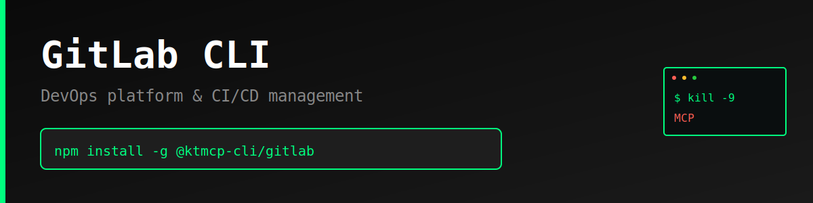

> "Six months ago, everyone was talking about MCPs. And I was like, screw MCPs. Every MCP would be better as a CLI."
>
> — [Peter Steinberger](https://twitter.com/steipete), Founder of OpenClaw
> [Watch on YouTube (~2:39:00)](https://www.youtube.com/@lexfridman) | [Lex Fridman Podcast #491](https://lexfridman.com/peter-steinberger/)

# GitLab CLI

Production-ready command-line interface for the [GitLab API](https://docs.gitlab.com/ee/api/) - DevOps platform and CI/CD management.

> **⚠️ Unofficial CLI** - This tool is not officially sponsored, endorsed, or maintained by GitLab. It is an independent project built on the public GitLab API. API documentation: https://docs.gitlab.com/ee/api/

## Features

- Complete coverage of GitLab API endpoints for projects, issues, merge requests, and pipelines
- Simple, intuitive command structure
- JSON and pretty-print output formats
- Persistent configuration storage
- Progress indicators for long-running operations

## Why CLI > MCP

### The MCP Problem

Model Context Protocol (MCP) servers introduce unnecessary complexity and failure points for API access:

1. **Extra Infrastructure Layer**: MCP requires running a separate server process
2. **Cognitive Overhead**: Agents must learn MCP-specific schemas on top of API semantics
3. **Debugging Nightmare**: Three layers (AI → MCP → API) instead of two (AI → API)
4. **Limited Flexibility**: MCP servers implement subsets of API features
5. **Maintenance Burden**: Every API change requires updating MCP server and docs

### The CLI Advantage

1. **Zero Runtime Dependencies**: No server process to manage
2. **Direct API Access**: One hop from agent to API
3. **Human + AI Usable**: Same tool works for developers and agents
4. **Self-Documenting**: Built-in `--help` text
5. **Composable**: Standard I/O piping and scripting
6. **Better Errors**: Direct API error messages
7. **Instant Debugging**: `--json` flag for exact API responses

## Installation

```bash
npm install -g @ktmcp-cli/gitlab
```

Or install locally:

```bash
cd gitlab
npm install
npm link
```

## Configuration

### Set API Token

Get your API token from https://gitlab.com/-/profile/personal_access_tokens

```bash
gitlab config set apiToken YOUR_TOKEN_HERE
```

### Environment Variables

Alternatively, use environment variables:

```bash
export GITLAB_API_TOKEN=your_token_here
export GITLAB_BASE_URL=https://gitlab.com/api/v4  # Optional, for self-hosted
```

### View Configuration

```bash
# Show all config
gitlab config list

# Get specific value
gitlab config get apiToken
```

## Usage

### Projects

```bash
# List projects
gitlab projects list

# Get project details
gitlab projects get 123

# Create project
gitlab projects create --name "My Project" --visibility private

# Delete project
gitlab projects delete 123
```

### Issues

```bash
# List issues
gitlab issues list --project-id 123

# Get issue details
gitlab issues get --project-id 123 --issue-id 45

# Create issue
gitlab issues create --project-id 123 --title "Bug found" --description "Details here"

# Close issue
gitlab issues close --project-id 123 --issue-id 45
```

### Merge Requests

```bash
# List merge requests
gitlab merge-requests list --project-id 123 --state opened

# Get MR details
gitlab merge-requests get --project-id 123 --mr-id 67

# Create merge request
gitlab merge-requests create --project-id 123 \
  --source-branch feature --target-branch main \
  --title "Add new feature"

# Merge MR
gitlab merge-requests merge --project-id 123 --mr-id 67
```

### Pipelines

```bash
# List pipelines
gitlab pipelines list --project-id 123

# Get pipeline details
gitlab pipelines get --project-id 123 --pipeline-id 89

# Create pipeline
gitlab pipelines create --project-id 123 --ref main

# Cancel pipeline
gitlab pipelines cancel --project-id 123 --pipeline-id 89

# Retry pipeline
gitlab pipelines retry --project-id 123 --pipeline-id 89
```

## JSON Output

All commands support `--json` flag for machine-readable output:

```bash
gitlab projects list --json
gitlab issues list --project-id 123 --json
```

## Examples

### AI Agent Use Case

```bash
# Create issue and extract URL
ISSUE=$(gitlab issues create --project-id 123 --title "Deploy bug" --json)
ISSUE_URL=$(echo $ISSUE | jq -r '.web_url')
echo "Issue created: $ISSUE_URL"

# Check pipeline status
gitlab pipelines list --project-id 123 --json | jq '.[] | select(.status=="running")'
```

### Automation Scripts

```bash
#!/bin/bash
# Create merge request from current branch
BRANCH=$(git branch --show-current)
gitlab merge-requests create \
  --project-id 123 \
  --source-branch "$BRANCH" \
  --target-branch main \
  --title "Automated MR from $BRANCH" \
  --json
```

## Error Handling

The CLI provides clear error messages:

```bash
$ gitlab projects list
Error: API token not configured. Run: gitlab config set apiToken YOUR_TOKEN

$ gitlab projects get invalid_id
Error: GitLab API Error: 404 - Project not found
```

## Development

```bash
# Clone the repository
git clone https://github.com/ktmcp-cli/gitlab.git
cd gitlab

# Install dependencies
npm install

# Run locally
node bin/gitlab.js --help

# Test commands
node bin/gitlab.js config set apiToken test_token
node bin/gitlab.js projects list
```

## License

MIT License - see LICENSE file for details.

## Links

- **Website**: https://killthemcp.com/gitlab-cli
- **GitHub**: https://github.com/ktmcp-cli/gitlab
- **npm**: https://www.npmjs.com/package/@ktmcp-cli/gitlab
- **GitLab API Docs**: https://docs.gitlab.com/ee/api/


---

## Support KTMCP

If you find this CLI useful, we'd greatly appreciate your support! Share your experience on:
- Reddit
- Twitter/X
- Hacker News

**Incentive:** Users who can demonstrate that their support/advocacy helped advance KTMCP will have their feature requests and issues prioritized.

Just be mindful - these are real accounts and real communities. Authentic mentions and genuine recommendations go a long way!

## Support This Project

If you find this CLI useful, we'd appreciate support across Reddit, Twitter, Hacker News, or Moltbook. Please be mindful - these are real community accounts. Contributors who can demonstrate their support helped advance KTMCP will have their PRs and feature requests prioritized.
